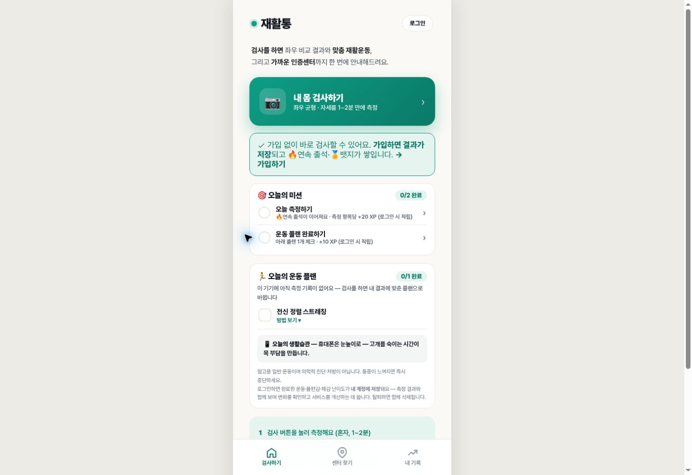
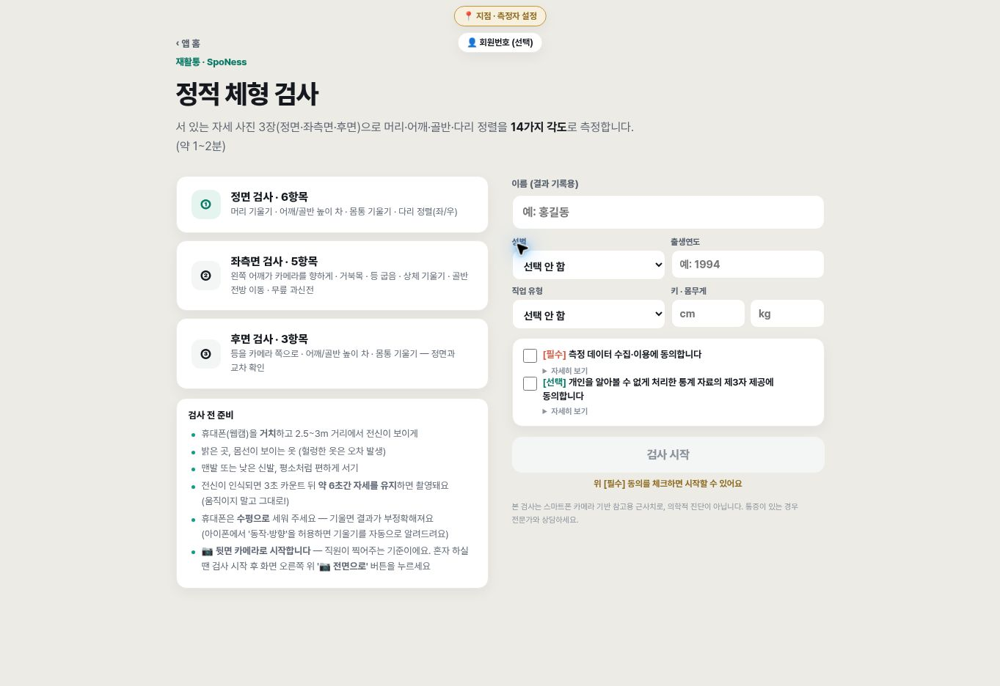
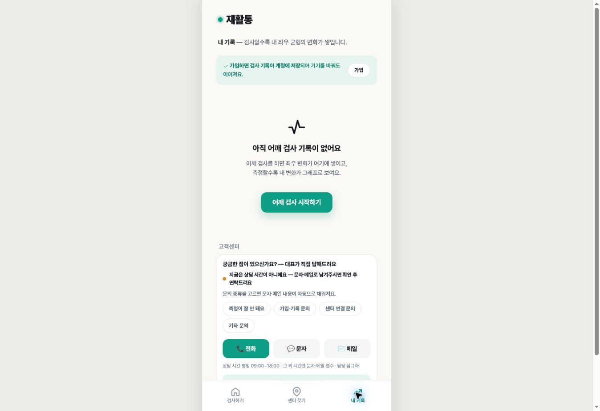

# 참고 사이트 검토 및 상세 리포트 적용

검토일: 2026-09-17
참고: https://jaehwaltong.vercel.app/

## 실제 확인한 흐름

1. 랜딩: 측정 → 결과 → 운동/센터 연결을 설명하는 구조. 가입 전 체험 CTA와 숫자 결과 예시가 명확하다.
2. 앱 홈: 검사 시작, 오늘의 미션, 운동 플랜, 하단 검사/센터/기록 탐색. 데스크톱에서도 좁은 모바일 폭이다. 작은 보조 글씨와 이모지에 의존한 표시의 접근성은 추가 검증이 필요하다.
3. 검사 선택: 정적 검사와 동적 검사 구분. 준비 중 항목은 구분해 표시한다.
4. 정적 검사 준비: 정면 6개, 측면 5개, 후면 3개 항목을 안내. 거리·복장·카메라 수평·촬영 방향 안내가 구체적이다. 개인정보 입력과 동의 단계가 있어 카메라 측정을 실행하지 않았다.
5. 어깨 검사 준비: 벽과 거리, 왼팔→오른팔 절차를 안내한다. 실제 신체 데이터로 검사를 실행하지 않았다.
6. 내 기록: 기록 없는 상태에서 검사 CTA를 제공한다. 임의의 변화 그래프를 표시하지 않는다.
7. 센터: 검증센터 목록과 위치 기반 탐색을 구분한다. 위치 권한을 부여하거나 상담을 전송하지 않았다.
8. 도움말: 측정, 기록, 동의, PDF 관련 안내가 있다. 일부 항목의 펼치기 상호작용은 이 브라우저에서 확인하지 못했다.

**한계:** 공개 홈/앱/검사/기록/도움말에서 사용자가 언급한 “데모리포트 보기” 진입점을 찾지 못했다. 실제 데모리포트와 측정 완료 화면을 열어 본 것처럼 주장하지 않는다. 본 변경은 관찰한 정보 구조와 기존 프로젝트의 실제 측정 데이터를 바탕으로 한 독자 구현이다. 로그인·카메라·회원 데이터 저장 및 모바일 기기 실측, 전체 접근성 준수는 검증하지 않았다.

## 화면 근거

## 프로젝트 적용

- `/analyze/demo`: 로그인·카메라·DB 불필요한 가상 데이터 데모. 회원 기록과 명확히 분리.
- 실제 정면/측면 측정 결과: 동일한 상세 리포트 컴포넌트와 실제 사진 오버레이 사용.
- 회원별 저장 리포트: 기존 인증 보호 경로 아래 `/members/[id]/posture/[resultId]`. 회원에 속하는 기록만 선택하고 불완전한 JSON은 표시하지 않음.
- 9개 항목의 값·앱 분류 기준·뜻·재확인 방법·측정 한계. 정면/측면 필터 및 키보드 접근 가능한 기본 컨트롤.
- 종합 점수는 기존 두 점수 평균. 의료적 건강 점수나 정확도/회복 확률로 표현하지 않음.
- 좌우 무릎 비율의 부호를 보존하여 차이를 %p로 표시. ROM·근력으로 표현하지 않음.
- PT/필라테스/스트레칭 상담 가이드. 사진으로 근육 단축이나 처방을 추정하지 않음.
- 실제 저장 기록만 변화 표에 표시. 비교 기록이 없으면 빈 상태 표시.
- 상세 리포트 인쇄/PDF 저장: 모든 필터 항목과 측정 한계 포함. 메모는 화면에만 존재하며 서버 저장하지 않음.
- 기존 이미지/공유 내보내기 유지, 설명은 더 정확한 측정 해석으로 교체.
- 새로운 DB 테이블이나 회원정보 공개 경로를 만들지 않음.
